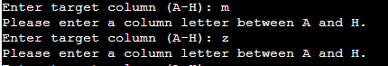

# Battle at Sea - Python Battleship Game

## [Live WebSite](https://pp3-battle-at-sea-a1894ff02de5.herokuapp.com/)

Welcome to **Battle at Sea**, a classic Battleship game implemented in Python. Engage in a strategic naval battle against the computer and demonstrate your tactical skills!

## Table of Contents

- [Game Description](#game-description)
- [Features](#features)
- [Testing](#testing)
- [Validator](#validator)
- [Bugs](#bugs)
- [Deployment](#deployment)
- [Credits](#credits)

## Game Description

**Battle at Sea** is a text-based implementation of the popular Battleship game. You'll take turns with the computer to strategically target and sink each other's ships on an 8x8 grid. The game provides a simple and enjoyable way to challenge your tactical thinking and luck against an AI opponent.

## Features

- __New User__

  - When starting the game as a new user, you'll be prompted to set up your game. You'll be asked to enter a username and password. These credentials are used to save and load your game progress for future sessions.

- __Boards__

  - The game displays two separate game boards side by side – "Your Board" and "Enemy's Board." These boards are represented as grids of cells, each containing information about hits, misses, and ships. The cells are marked with symbols to indicate their status.

- __Wrong Letter Input__

  - If you accidentally input an incorrect letter (outside the range "A" to "H") when selecting a target column, the game will prompt you to re-enter a valid column letter. This ensures that your inputs conform to the allowed range.

__Wrong Number Input__

  - In the event of inputting an invalid number (outside the range 1 to 8) when selecting a target row, the game will prompt you to provide a valid row number. This prevents any incorrect inputs and ensures the game's rules are followed.

__Successful Move__

  - A successful move is achieved when the player enters the correct numerical and alphabetical coordinates within the specified ranges. This input accuracy ensures that the player's actions align with the game's mechanics, facilitating strategic decision-making and contributing to a satisfying gameplay experience.

__Final Board__

  - After the game concludes, the "Final Board" is displayed. This shows the outcome of the game, indicating the location of all ships, hits, and misses. The "Final Board" provides a comprehensive overview of the naval battle's results.

__Play Again__

  - After completing a game, you'll have the option to play again. If you choose to play again, the game will reset, and you'll be ready to engage in another exciting round of naval warfare.

## Testing
## Features in Action

1. __Game Demonstrations__
- Action: Showcase player's and adversary's game setups
- Anticipated Outcome: Visualize the game state for both sides.
- Observed Outcome: Boards are displayed accurately.

2. __Conclusive Situation__
- Action: Reveal final status of player's and rival's game fields
- Anticipated Outcome: Display the end state of the game.
- Observed Outcome: Final boards are unveiled as projected.

3. __Fresh Entrant__
- Action: Enroll as a new user with a unique username and password
- Anticipated Outcome: Initialize game setup for the newcomer.
- Observed Outcome: User prompted to configure a game upon registration.

4. __Resumption Choice__
- Action: Elect to recommence the game after accomplishing a round
- Anticipated Outcome: Continue the ongoing game from the prior point.
- Observed Outcome: User offered the option to initiate another game.

5. __Productive Move__
- Action: Input precise target coordinates (e.g., 3C)
- Anticipated Outcome: Successfully strike an adversary ship and reduce missile count.
- Observed Outcome: Hit acknowledged, missile count updated.

6. __Incorrect Letter Insertion__
- Action: Provide improper column letter (e.g., Z)
- Anticipated Outcome: Prompt for a valid column letter (A-H).
- Observed Outcome: User guided to enter a valid letter.

7. __Inappropriate Number Submission__
- Action: Enter unsuitable row number (e.g., 9)
- Anticipated Outcome: Request for a valid row number (1-8).
- Observed Outcome: User instructed to input a valid number.

## Validator

- No errors were found when passing the code in the [Pep8 Validator](https://pep8ci.herokuapp.com/)

## Bugs

1. __Bug:__ Incorrect Win Condition Logic

- __Description:__ In the 'play' method, the win condition logic was not correctly comparing the number of hits by the player and the computer. This caused incorrect determination of the winner based on the number of hits.
- __Solution:__ The win condition logic was corrected to compare the number of hits by the player and the computer accurately. The corrected logic ensured that the correct outcome (player win, computer win, or draw) was displayed at the end of the game.

2. __Bug:__ Infinite Loop in Computer's Turn

- __Description:__ In the 'computer_turn' method, there was a possibility of the code entering an infinite loop if there were no available locations left on the player's board to shoot at.
- __Solution:__ The code in the 'computer_turn' method was modified to handle cases where there are no available locations left to shoot at on the player's board. If all locations had already been shot at, the computer's turn would end without attempting to shoot.

3. __Bug:__ Incorrect Range Check in Password Validation

- __Description:__ In the 'check_password' function, the validation of the entered password against the stored passwords was using the wrong range check, causing it to return incorrect results.
- __Solution:__ The range check in the check_password function was corrected to compare the entered password with the stored password using the correct condition ('stored_passwords.get(username) == entered_password').

## Deployment 

__Deploying the Project on Heroku:__

- Open your GitPod terminal and ensure you've saved the library requirements using the command "pip freeze -> requirements.txt". This prepares the libraries for installation on Heroku.
- Log in to your existing Heroku account or create a new one if needed.
- Click the "New" button at the upper-right corner and select "Create New App".
- Provide a unique name for your app and select your preferred region. Click "Create App". Remember, the app name must be distinctive.
- Proceed to the "Settings" tab. Add the Python build pack first, then the Node.js build pack. This ensures compatibility with the Code Institute's pre-installed template.
- Create a "Config VAR" with the key 'CREDS'. Enter the corresponding value from the creds.json file.
- Create a second "Config VAR" using the key 'PORT' and set its value to '8000'.
- Go to the "Deploy" tab and choose GitHub as your deployment method.
- Search for your repository and connect it.
- Enable automatic deploys and deploy the selected branch.
- Allow a brief moment for the app to build. Once complete, click the "View" link to access your deployed app.

__Forking the Repository:__

- Navigate to the GitHub repository you wish to engage with.
- Click the Fork button located in the upper-right corner.

__Cloning the Repository:__

- Find the GitHub repository you want to clone.
- Click the Code button situated above the list of files.
- Select your preferred cloning method—whether it's HTTPS, SSH, or Github CLI. Copy the repository URL to your clipboard using the provided copy button.
- Launch Git Bash on your local machine.
- Navigate to your desired directory using the command line.
- Execute the "git clone" command, followed by the URL copied from the clipboard (e.g., $ git clone https://github.com/username/repository).
- Press Enter to begin cloning the repository and establish a local copy on your machine.

## Credits

- Code Institute Python Classes
- This project was inspired by https://ci-pp3-battleships-clinelly.herokuapp.com/
- ArjanCodes https://www.youtube.com/watch?v=u3yo-TjeIDg&ab_channel=ArjanCodes

